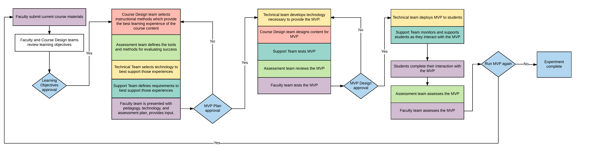
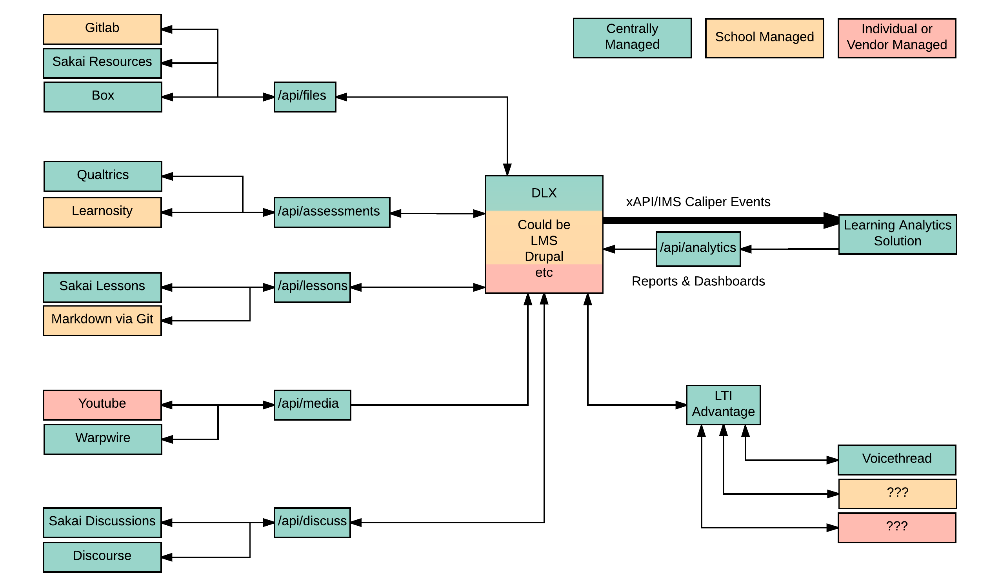

# A Designed Learning Experience (DLX)

Students, ~~take a series of courses in a curriculum~~ take a single learning experience. A DLX can be created at the module or course level, but is most powerful at the program level. A DLX is designed not by individual faculty, but by a team of faculty, instructional designers, UX designers, and web developers.

Students use whatever best of breed technologies the design team feel best meets the learning goals of the curriculum. Every tool is deeply integrated into a single user interface design.

Students always feel a sense of place in the DLX, knowing where they just were, where to go next, where they are compared to their peers, where they are in the overall curriculum.

## The DLX Design Process
...is a process for testing leading pedagogical and technological strategies including [Next Gen Digital Learning Environments](https://library.educause.edu/topics/teaching-and-learning/next-generation-digital-learning-environment-ngdle) and provide students with a modern learning and user experience. 

### Backwards design
start with learning objectives. 

### Lean and agile
can be applied to a module, course, or program

### Integrated UX
tools are deeply integrated to provide students with a seamless learning experience. (Hint, this is not iframes within iframes)

Because of the way the edtech industry has evolved, this will limit your choices as not every tool has been designed to offer its functionality outside of its design. But times are a changing, some companies get this.

Open source options become much more appealing in this model. With more flexible business model options.

## DLX Examples

